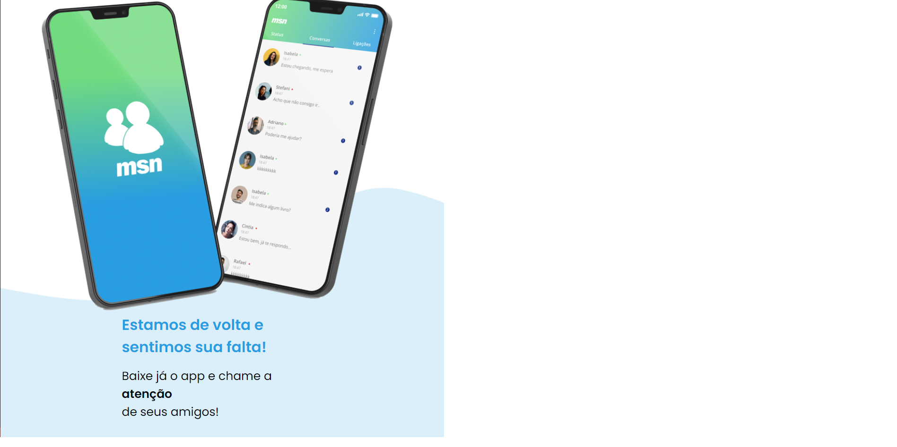
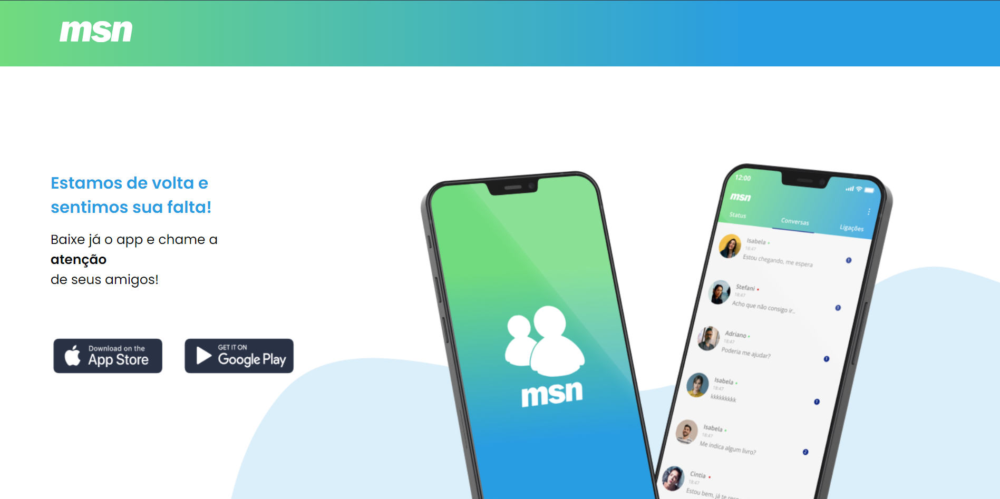

# MSN - Bem Vindo
----------------
O objetivo desse projeto, foi realizar um conceito de como seria a volta do grande MSN que marcou um geração.  

**Tecnologias** usadas:  

**Responsivo**: *Sim*

**Screenshots** da página:

**Mobile**:

**Desktop**:

**Link**: https://thiagothree.github.io/msn-bem-vindo/